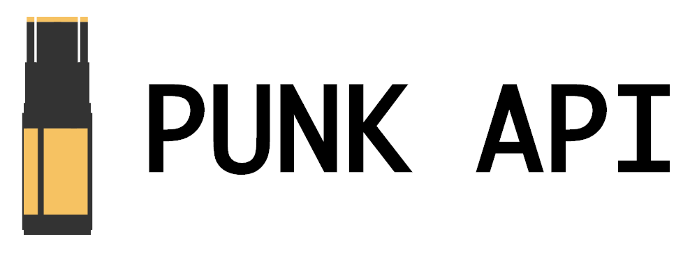
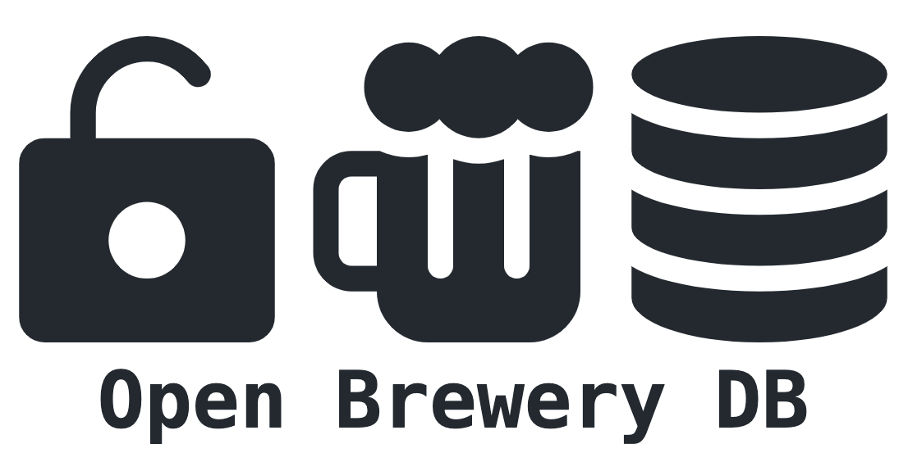
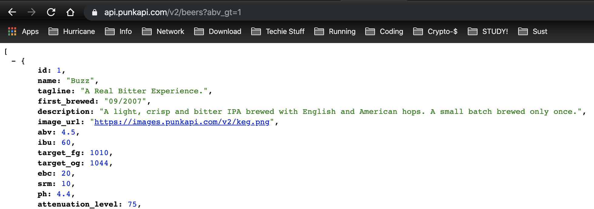
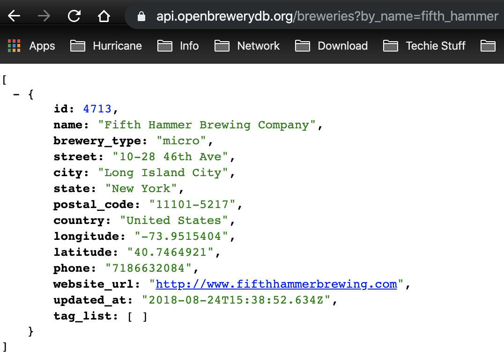

# Working title: "Beer is Good for You!" #

### Learned from Project 1 ###
- I want to create a project that is more dynamic / interactive. Therefore, I want to use user input to render information on the page. 
- Navigation buttons are important to go back and forth through the page. 
- More attention to CSS styling and making it look nice / clear app style with consistent colours and style layout.
- Try to make an actual good scalable mobile option. 

## Wireframes: ##

#### Landing Page ####

Landing page. Should be mostly CSS + Images. At least 2 buttons at the bottom underneath the logo that lets you choose between >=21 || <21 before you can continue to the website. Possibly, I could create an alternative route for the <21 button that leads you to another page that educates on the use of alcohol...... 

#### Home Page ####

The homepage is going to contain a header / main / footer section. Within the header I want to create the navigation bar that contains the Link elements for the Route function. And since this will be on every page it allows you to navigate through the site. 

The main element is going to contain approximately 8 div elements that function as buttons. Most likely displayed within a GRID of 4 x 2. Which should make it easier to make it mobile friendly / responsive and adjust in the @Media queries. The buttons are going to provide various search options. Search for (examples): 

1. Beer
2. ABV (Alcohol by Volume)
3. IBV (International Bitterness Units)
4. EBC (European Beer Convention (Colour))
5. Random Beer Generator
6. Beer that matches certain food
7. Brewery by name
8. Brewery by state

As soon you click on one of the buttons it will Route you to a Search Page that enables you to conduct the search. 

The footer will not contain much. I might use this for the stretch goals, more information below. 

#### Search Page ####

The search page will contain only a search button that is being triggered by the enter button and return the search query. I want to make sure that in case multiple results are being returned, you are able to click on a brewery and see detailed information. 

## API: ##
### Beer look-up / information functionality ###

API: https://punkapi.com/
Endpoint: https://api.punkapi.com/v2/

### Brewery look-up / information functionality ###

API: https://www.openbrewerydb.org/
Endpoint: https://api.openbrewerydb.org/breweries

## API results ##
Both API's do not require an API key and are easily accessible. Therefore, I do not foresee any problems. Below are two example results that can just be run in the browser. 

#### Punk-Api ####

#### Open-Brewery-Api ####

## LOGO ##
### Font Awesome ###

Additional styling with logos from Font Awesome

## Features: ##
Give you the tools to run any beer related search. Whether it is a specific beer, or if you want to find a new dark beer to try, or if you just want to know more about the brewery, you're at. 

- Various search options related to beer and breweries
- Let you generate a random beer to try next time
- Find all breweries in the state you are

Display:
- Full Screen but good scalable (no fixed units)
- *Mobile page*

## Future features / Stretch goals: ##
- Use local storage to save choice >= 21 / 21 and prevents landing page if you visit again.
- Add the cocktail api to extend the search options! Because, why not. It's alcohol as well. (https://www.thecocktaildb.com/api.php)
- Use the weather API to check for the current weather at your location. Not sure if possible, but otherwise, use location of user / device to determine weather forecast. And make suggestion if today is a great day to drink beer :-) This should all be incorporated in the Footer and visible on every page to promote drinking. 

## Technology / Resources used: ##
- React
- React-Router
- Axios
- Font Awesome
- Google Fonts
- Punk API
- Open Brewery API
- Weather Api (stretch goal)
- Cocktail DB Api (stretch goal)